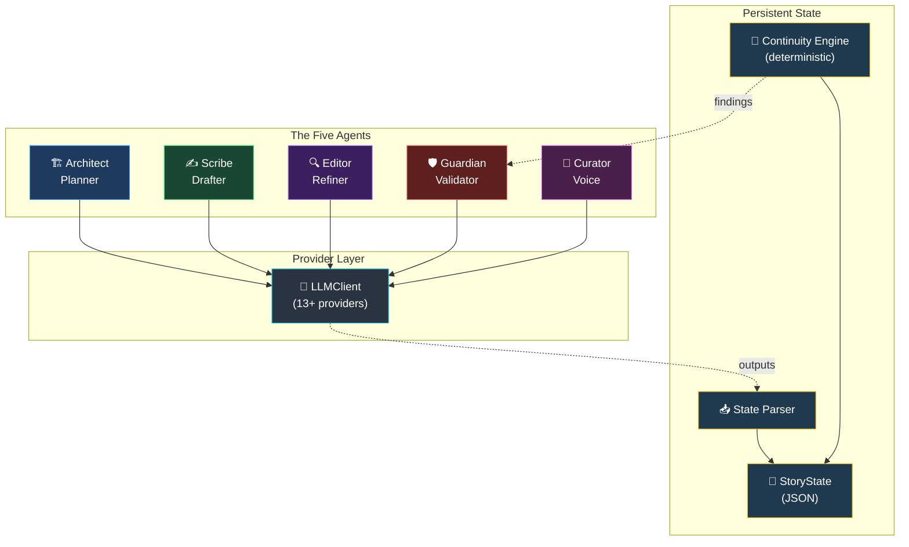
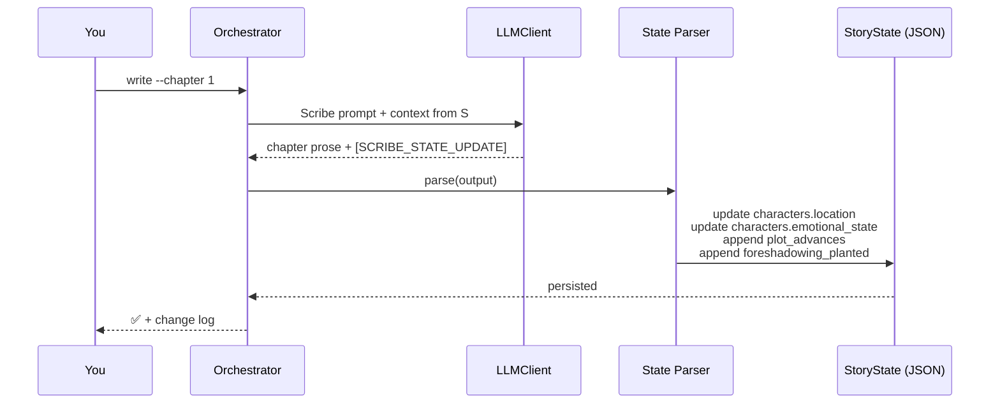
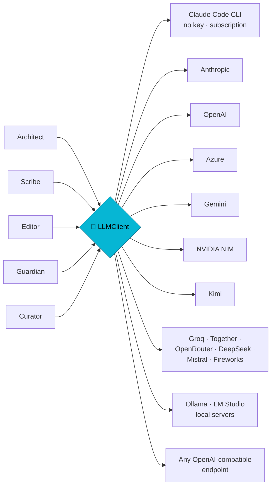

<div align="center">
  
</div>

<div align="center">
<h3>A Writing Studio with a Story Model That Knows When an Edit Breaks the Book</h3>

<p><em>Scrivener's structure, Word's editing surface, and an agent pipeline that remembers chapter 3.</em></p>

<br/>

[](https://python.org)
[](LICENSE)
[]()
[]()
[]()
[]()

<br/>

```
╔══════════════════════════════════════════════════════════════════╗
║                                                                  ║
║   "The difference between an amateur and a professional          ║
║    writer is a systematic process."                              ║
║                                                                  ║
║                              Novel OS Philosophy               ║
╚══════════════════════════════════════════════════════════════════╝
```

</div>

---

## 🌟 What is Novel OS?

**Novel OS** is a complete **editorial infrastructure** for producing professional-quality novels using multiple specialized AI agents working in concert with any LLM you choose (Claude, GPT, Gemini, Llama, Kimi, local models, anything OpenAI-compatible).

Traditional AI writing generates one response and forgets everything. Novel OS is different:

- 🧠 **Persistent memory** agent outputs are parsed and merged into a central state file. Characters, locations, plot threads, foreshadowing, and quality scores accumulate chapter by chapter.
- 🤝 **Agents collaborate** Architect → Scribe → Editor → Guardian → Curator, each handing off to the next with full context.
- 🛡️ **Deterministic + LLM validation** a free local continuity engine catches dormant threads, unresolved foreshadowing, and timeline drift *before* the LLM Guardian runs.
- 🔌 **Provider-agnostic** Anthropic, OpenAI, Azure, Gemini, NVIDIA NIM, Kimi, Groq, Together, OpenRouter, DeepSeek, Mistral, Fireworks, Ollama, LM Studio, or any OpenAI-compatible endpoint.

> Think of it as hiring a **full-time editorial team** story architect, prose craftsman, line editor, fact-checker, voice coach all working on your novel around the clock, on infrastructure that actually remembers what happened in chapter 3.

<p align="center"></p>

---

## 🖼️ The Studio

Novel OS is a **writing studio**, not just a CLI. The engine still runs headless the command line is a first-class way to use it but the day-to-day surface is a browser app with a real manuscript editor.

### Three modes, not four stages

Writers move between **planning, writing and revising** constantly, and rarely in order. The mode switch (`⌘1` `⌘2` `⌘3`) re-lays out the whole studio around whichever one you're in. The pipeline's four stages still exist, but as *provenance* where a paragraph came from rather than as a workflow you're supposed to march through.

<p align="center"></p>

**Plan** leads with structure the shape-of-the-book strip, the outliner, the Codex and the relationship chart.

### Write mode gets out of the way

<p align="center"></p>

Both rails collapse, continuity runs silently, and **nothing volunteers itself** no ghost text, no hovering suggestions, no token meter. Select a passage and a single bar appears with the only four things worth doing to it. That's the whole AI surface while you're drafting.

### Revise shows you the book as it is

<p align="center"></p>

The Inspector opens on continuity with real findings and here's the part that matters **"This is intentional."** A checker can't tell an unreliable narrator from a mistake, so every finding can be dismissed with a reason that persists into `story_state.json`. The Guardian reads those exemptions too, so the AI never re-litigates a call you've already made.

<p align="center"></p>

Compile lives here too: named styles drive the export, so you change what "Block Quote" means once and the whole book follows.

---

## 🏛️ Architecture



---

## 🎭 The Five Agents

| # | Agent | Role | Outputs |
|---|---|---|---|
| 1 | 🏗️ **Architect** | Story planner designs 3-act structure, character arcs, beats | `outline.json`, expanded `chapter_NNN_outline.md` |
| 2 | ✍️ **Scribe** | Prose drafter writes the chapter in deep POV | `chapter_NNN_draft.md` + `[SCRIBE_STATE_UPDATE]` block |
| 3 | 🔍 **Editor** | Line surgeon 5 modes: line / developmental / pacing / dialogue / tension | `chapter_NNN_revised.md` + `[EDITOR_STATE_UPDATE]` with before/after scores |
| 4 | 🛡️ **Guardian** | Forensic fact-checker character, timeline, world, plot continuity | `chapter_NNN_continuity_report.md` with `Status: PASS/WARNING/FAIL` |
| 5 | 🎨 **Curator** | Voice stylist locks tone, prose rhythm, genre conventions | `[STYLE_STATE_UPDATE]` with consistency / genre / voice scores |

Every agent prompt now includes a strict **OUTPUT CONTRACT** that forces the LLM to emit machine-parseable update blocks verified working with frontier models (Claude, GPT) and open-weight models (Llama 3.3 70B).

---

## 🔄 The Chapter Workflow


**Quality gates** a chapter cannot be approved while `Status: FAIL` is on file. Resolve the issue and re-validate.

<p align="center"></p>

---

## 🧠 Persistent Memory How State Actually Lives

The defining feature: **every agent's structured output is parsed and merged into a central JSON state**, so subsequent agents see what came before.



Captured per chapter: character locations, emotional states, last-appearance index, key events, foreshadowing planted/resolved, new information revealed, editor quality scores (before/after), continuity status & issues, style scores.

---

## 🔬 The Continuity Engine

Deterministic, free, instant runs before the LLM Guardian on every `validate`, and on demand via `check`.

| Check | Severity | Catches |
|---|---|---|
| `dormant_thread` | warning | Active plot threads idle >3 chapters |
| `overdue_thread` | **critical** | Threads past their `target_resolution_chapter` still active |
| `unresolved_foreshadowing` | warning | Planted seeds with no matching `resolved` entry |
| `absent_character` | warning | Main characters silent >5 chapters |
| `never_appeared` | warning | Protagonists/antagonists who never showed up |
| `dead_character_state` | warning | Flagged-dead characters with active state |
| `missing_chapter_file` | **critical** | Chapter marked complete but no manuscript file |
| `status_drift` | info | Draft exists but status still `planned` |
| `thin_character` | info | Main characters with no `internal_desire` set |
| `relationship_orphan` | warning | A bond pointing at someone who isn't in the cast |
| `hostile_pair_co_present` | warning | Enemies sharing a scene with no acknowledgement |
| `relationship_since_anachronism` | warning | A bond that starts before the people meet |
| `contradictory_relationship` | warning | Two bonds that can't both be true |
| `dead_bonded_co_presence` | **critical** | A dead character still turning up in scenes |
| `stalled_middle` | warning | See below the one nobody else checks for |

```bash
python core/orchestrator.py check                 # check whole project
python core/orchestrator.py check --chapter 12    # check as-of a specific chapter
```

Findings are also injected into the LLM Guardian's prompt as context the Guardian gets a head start instead of rediscovering obvious issues, and you don't spend tokens on them.

### Every finding can be wrong and you can say so

A checker cannot tell an unreliable narrator, deliberate foreshadowing, or a character who *lies* from a genuine mistake. So each finding carries **"This is intentional"**, with a reason, persisted into `story_state.json` and keyed to the *fact* rather than the wording so a dismissal survives rewordings and re-sightings. The filter lives in the engine, which means the panel, the CLI and the Guardian all agree.

Without that, a continuity panel re-raises the same non-error every run until you stop reading it and a check you ignore is worth less than no check at all.

### The sagging middle, measured

Middles are where books die, and the failure has a shape: **the protagonist goes reactive** things happen *to* them and they stop pursuing anything. That sounds subjective, but it decomposes into things the state already records per chapter plot advances, character development, emotional beats, new information, threads touched.

A chapter that changes none of them didn't move the story. Three consecutive such chapters are the sag. Entirely deterministic **no model is asked whether your book drags** and shown as a shape-of-the-book strip, one bar per chapter, with sagging runs named in plain language.

---

## 🔌 Provider-Agnostic LLM Layer

Pick any of these auto-detected from whichever API key is present:

| Provider | `NOVEL_OS_LLM_PROVIDER` | Key env var |
|---|---|---|
| **Claude Code CLI (no API key free with your subscription)** | `claude_cli` | (just `claude login`) |
| Anthropic Claude | `anthropic` | `ANTHROPIC_API_KEY` |
| OpenAI | `openai` | `OPENAI_API_KEY` |
| Azure OpenAI | `azure` | `AZURE_OPENAI_API_KEY` + `AZURE_OPENAI_ENDPOINT` |
| Google Gemini | `gemini` | `GEMINI_API_KEY` |
| NVIDIA NIM | `nvidia` | `NVIDIA_API_KEY` |
| Kimi / Moonshot | `kimi` | `KIMI_API_KEY` |
| Groq | `groq` | `GROQ_API_KEY` |
| Together AI | `together` | `TOGETHER_API_KEY` |
| OpenRouter | `openrouter` | `OPENROUTER_API_KEY` |
| DeepSeek | `deepseek` | `DEEPSEEK_API_KEY` |
| Mistral | `mistral` | `MISTRAL_API_KEY` |
| Fireworks | `fireworks` | `FIREWORKS_API_KEY` |
| Ollama (local) | `ollama` | |
| LM Studio (local) | `lmstudio` | |
| **Any OpenAI-compatible endpoint** | `openai_compatible` | `NOVEL_OS_API_KEY` + `NOVEL_OS_BASE_URL` |



---

## 🚀 Quick Start

```bash
git clone https://github.com/mrigankad/Novel-OS.git
cd Novel-OS
pip install -r requirements.txt   # install only the SDKs you need
```

### 0 Configure model providers

Open **Studio Settings -> Models & providers** to add Codex, OpenAI,
OpenAI-compatible, Anthropic, OpenRouter, or Ollama connections. Assign a
default text route, optional agent-specific overrides, and a cover image model.
One connection can provide both text and image generation; API keys are stored
separately from normal Studio metadata and are never returned by the API.

With Codex installed and `codex login` completed, the Codex connection uses the
existing login for text generation and the `gpt-image-2` image tool without
copying credentials into Novel OS.

For headless setup, the existing wizard and environment variables remain
available:

Let the setup wizard detect what you already have the Claude Code CLI, any API
key, or a local model server test the connection, and write your `.env` for you:

```bash
python core/orchestrator.py setup        # or: python -m core.setup_wizard
```

> **No API key?** If you have the [Claude Code CLI](https://docs.claude.com/claude-code)
> installed and `claude login` done, Novel OS runs entirely on your subscription —
> the wizard picks it automatically, and there are zero per-token API charges.

Prefer to configure by hand? `cp .env.example .env` and set your key(s). If you run a
writing command with nothing configured, Novel OS offers the wizard automatically.

For an OpenAI-compatible gateway:

```bash
NOVEL_OS_LLM_PROVIDER=openai_compatible
NOVEL_OS_BASE_URL=https://your-provider.example/v1
NOVEL_OS_API_KEY=your-key
NOVEL_OS_MODEL=your-model-id
```

To generate commercial covers through an Images API and `gpt-image-2`, either reuse the
same endpoint and key or set an independent cover credential in the ignored
`.env` file:

```dotenv
NOVEL_OS_COVER_BASE_URL=https://your-provider.example/v1
NOVEL_OS_COVER_API_KEY=your-key
NOVEL_OS_COVER_MODEL=gpt-image-2
NOVEL_OS_COVER_SIZE=2048x3072
NOVEL_OS_COVER_QUALITY=high
NOVEL_OS_COVER_FORMAT=jpeg
NOVEL_OS_COVER_COUNT=4
```

If the cover URL or key is empty, Novel OS falls back to `NOVEL_OS_BASE_URL`
and `NOVEL_OS_API_KEY`. Credentials are never written to prompts, candidate
manifests, packages, API responses, or job metadata.

### One prompt to a complete book

The full-book runner preserves the source prompt, creates a structured story
foundation, writes chapters sequentially, checkpoints every stage, and compiles
only approved Final artifacts:

```bash
python core/orchestrator.py run \
  --project ./projects/the-life-she-kept \
  --prompt ./prompt/master-prompt.md \
  --chapters 24 \
  --words 80000 \
  --approval auto \
  --output markdown epub
```

`--chapters` and `--words` are optional. When omitted, the runner infers them
from the prompt (including chapter ranges and words-per-chapter ranges).

Omit `--approval auto` to review each `chapter_NNN_candidate_final.md`. Approve
one waiting chapter and continue with:

```bash
python core/orchestrator.py resume \
  --project ./projects/the-life-she-kept \
  --run-id RUN_ID \
  --approve-chapter 1
```

Use `run-status` to inspect a run and `retry` for its current failed or blocked
stage. Checkpoints live under `outputs/runs/<run-id>/`; compiled files are placed
under `outputs/deliverables/`.

### 1 Initialize

```bash
python core/orchestrator.py init --title "The Last Signal" --genre "Sci-Fi Thriller"
```

### 2 Cast

```bash
python core/orchestrator.py character add --name "Lena Vasquez" --role protagonist
python core/orchestrator.py character add --name "Director Malk" --role antagonist
```

### 3 Plan

```bash
python core/orchestrator.py plan outline --chapters 32
python core/orchestrator.py plan chapter --number 1 --pov "Lena Vasquez"
```

### 4 Write, edit, validate

```bash
python core/orchestrator.py write --chapter 1                     # Scribe drafts
python core/orchestrator.py edit  --chapter 1 --mode line         # Editor polishes
python core/orchestrator.py check --chapter 1                     # free pre-check
python core/orchestrator.py validate --chapter 1                  # Guardian validates
python core/orchestrator.py approve  --chapter 1                  # gates on FAIL
```

Every phase command also accepts `--dry-run` to emit the prompt without calling the LLM useful for hand-running in a chat UI.

### 5 Track & export

```bash
python core/orchestrator.py status
python core/orchestrator.py export --format markdown
```

---

## 🖥️ Running the Studio

Two processes the API and the React app:

```bash
# 1. Backend (from repo root)
pip install -r requirements.txt
export NOVEL_OS_PROJECTS_DIR=./projects   # folder of project dirs
export NOVEL_OS_MEDIA_DIR=./media         # uploaded images (default ./media)
uvicorn api.main:app --reload --port 8000

# 2. Frontend (in another terminal)
cd web && npm install && npm run dev      # http://localhost:5173
```

Each project is a folder under `NOVEL_OS_PROJECTS_DIR` containing
`outputs/state/story_state.json` created by `python core/orchestrator.py init …`,
or by **New Manuscript** in the app. There's a sample project on first run if you
just want to look around.

| Env var | Purpose |
|---|---|
| `NOVEL_OS_PROJECTS_DIR` | Where projects live (default `./projects`) |
| `NOVEL_OS_MEDIA_DIR` | Uploaded images (default `./media`) |
| `NOVEL_OS_DB` | SQLite by default; Postgres by changing the URL |
| `NOVEL_OS_CORS_ORIGINS` | Comma-separated browser origins (default: Vite's 5173 and 5174) |

### Docker deployment

Docker Compose builds the React app, serves it through Nginx, and proxies
`/api` to the FastAPI container. The Studio is exposed on port `5174` and all
runtime data is persisted under the gitignored `docker-data/` directory. Set
`NOVEL_OS_DATA_DIR` when the data directory should live elsewhere; the launcher
passes the same absolute path to Compose and its run/status commands.

```bash
./deploy.sh up       # build, start, and wait for both health checks
./deploy.sh logs     # follow frontend and backend logs
./deploy.sh status   # show container health and the local URL
./deploy.sh down     # stop containers without deleting manuscripts
```

To keep data outside the repository, configure it in `.env` so every launcher
command uses the same directory. Relative paths are based on the repository root.

```dotenv
NOVEL_OS_DATA_DIR=/srv/novel-os-data
NOVEL_OS_WEB_PORT=5174
```

The current Compose configuration mounts both `~/.codex/auth.json` and
`~/.codex/config.toml`, even when an API-key provider is selected. Both must
exist as files before starting; missing paths fail instead of becoming empty
directories. Use the host's Codex login for `auth.json`; if no custom Codex
configuration is needed, `config.toml` can be an empty file. Set
`NOVEL_OS_CODEX_AUTH_FILE` and `NOVEL_OS_CODEX_CONFIG_FILE` in `.env` when these
files live elsewhere. Auth remains writable for token refresh; config is read-only.

Start a complete novel through the interactive launcher. It lists the Markdown
files under `prompt/`, infers chapter and word targets by default, and hides all
container paths and stable pipeline options:

```bash
./deploy.sh novel          # choose a prompt and confirm the run interactively
./deploy.sh novel --help   # show every available command and option
./deploy.sh novel-status   # inspect the most recently updated run
./deploy.sh novel-resume   # continue the most recently updated run
./deploy.sh novel-retry    # retry its current failed or blocked stage
```

The novel commands reuse the healthy backend container, never recreate an
existing service, and do not manage the frontend. Use `./deploy.sh restart`
explicitly after changing application code or deployment configuration.

Generate and manage cover candidates without restarting healthy services:

```bash
./deploy.sh novel-cover --help
NOVEL_OS_PROJECT_NAME='my-novel' NOVEL_OS_COVER_COUNT=4 \
  ./deploy.sh novel-cover './prompt/my-novel.md'
./deploy.sh novel-cover list 'my-novel'
```

The Prompt must contain the approved `COVER_HANDOFF_BEGIN` / `COVER_HANDOFF_END`
JSON emitted by `novel-brainstorm-workshop`. Generation creates 3-5 independent
portrait `2:3` candidates at the provider's native resolution. Review and select them at
`http://localhost:5174/projects/PROJECT/covers`; only failed candidates consume
an image call when retried. `novel-cover` reuses a healthy backend and never
runs `up`, `restart`, or `down` on its behalf.

To skip prompt selection, pass the file directly:

```bash
./deploy.sh novel './prompt/master-prompt.md'
```

Provider credentials are loaded from the existing `.env` file. When an
OpenAI-compatible provider runs on the Docker host, use
`http://host.docker.internal:PORT/v1` instead of `http://127.0.0.1:PORT/v1`.
Set `NOVEL_OS_WEB_PORT` before running the script to override port `5174`.

### Cover Studio：故事驱动的封面设计系统

Cover Studio 不是把书名套进固定海报模板，也不是直接把整本小说交给图片模型
自由发挥。它把**故事事实提取、艺术指导、提示词编译、图片渲染、视觉复核和人工
选图**拆成有证据、可审批、可重试的独立步骤。


#### 封面事实从哪里来

系统会把以下已有产物组织为带来源的视觉证据，而不是只读取一句简介：

- 已批准 Prompt 中的 `COVER_HANDOFF_BEGIN` / `COVER_HANDOFF_END`；
- 主角、关系图、核心任务、核心冲突、情绪承诺和决定性故事节点；
- 序言、出版文案、`StoryState` 与最终正文中的可视化动作、空间、物件和仪式；
- 目标市场、标题语言、生活环境、禁用元素和剧透边界；
- 本项目及近期项目的封面指纹，用于降低跨小说的构图和风格重复。

方向会绑定输入事实和视觉证据的哈希。Prompt、序言、出版文案、StoryState 或最终
正文发生变化后，旧方向会被标记为 `stale`，需要重新规划，避免用过期故事事实
生成新图片。

#### Cover Director、Image2 与 Skill 的职责

| 组件 | 职责 | 不负责什么 |
|---|---|---|
| `novel-brainstorm-workshop` | 完成故事设计并输出严格的封面交接事实 | 不直接调用图片模型 |
| `novel-cover-studio` | 在 Codex 主机侧组织封面规划、审批、生成和选图流程 | 不替代 Web 后端代码 |
| Cover Director | 读取证据并动态决定构图、场景、摄影处理、情绪和字体系统 | 不渲染图片 |
| `cover-compiler.v13` | 保护人物、冲突、书名、具体镜头/布光/配色及视觉语言，在统一 12,000 Unicode code points 总预算内编译提示词 | 不重新发明故事事实 |
| `gpt-image-2` | 按方向生成原生分辨率的竖版 `2:3` 图片 | 不决定整组封面的策划逻辑 |
| 多模态视觉复核 | 对照原图、手机缩略图和方向契约检查实际可见结果 | 不代替运营最终选图 |

默认采用**真人实拍质感的电影宣传照**，保留清晰人物、自然年龄与皮肤、真实服装、
合理光线和可读的故事动作。艺术性来自构图、镜头、人物调度、场景、光色和字体，
而非把不同方案分别转成油画、水粉、版画、纸浮雕或 3D。

旧版 Cover Director 曾自动写入 `gouache-and-ink editorial illustration` 等
`art_style`。v8 规划会检查并修复这类媒介偏差；编译器也会在生图前拦截旧的绘画方向，
提示重新规划。摄影要求计入总字符预算并保持完整，图片质检同样检查实际渲染的摄影感。
`high` 和高分辨率并不会自行纠正油画提示词；默认请求保持 `2048x3072 / high`。

#### 本书视觉语言与核心冲突视觉契约

`cover-profiles.v8` 保留核心冲突规则，先生成两份书级设计约束，再规划单张封面：

1. **Book Visual Identity**：设计命题、情绪矛盾、故事签名、材料语言、调色和
   光线逻辑、空间逻辑、字体声音、人物策略、陈词滥调黑名单、独特性锚点和剧透
   边界。
2. **Core Conflict Visual Contract**：读者代入的主角、压力来源、参与冲突的
   已批准人物、关系或身份利害关系、可见原因、决定性后果、至少两个可绘制信号、
   证据引用和剧透边界。

每张方向还必须说明：

- `causal_visibility`：冲突原因是直接可见还是由具体证据间接呈现；
- `conflict_delivery`：这张图用什么独特视觉方法连接原因与后果；
- `conflict_read`：用户在手机缩略图上能读懂的一句话故事；
- `cause_signal` / `consequence_signal`：画面中的原因和主角承担的后果；
- `conflict_character_ids`：本张实际出现的已批准冲突人物；
- `protagonist_action_visible`：主角是否正在选择、拒绝、发现、对抗、保护或离开，
  而不是只摆出悲伤表情。

这些字段在生成图片之前进行确定性验证。核心冲突明确点名的人物不会被悄悄省略，
也不会把已确认的背叛、排斥、隐瞒或家庭替代关系弱化成抽象的“疏离感”。同样，
系统也不会把原文没有确认的暧昧升级成出轨、暴力或其他新剧情。

#### 四张封面如何保持不同又讲清同一本书

默认四张封面是四种不同的设计论点，不是同一张图换颜色或镜头：

- 至少一张直接呈现完整的已批准因果关系（人物是压力来源时，完整呈现该关系）；
- 至少一张展现主角清晰、主动且符合剧情的决定；
- 其余方案按具体故事选择人物数量和表达方式，每张仍需可见的原因、主角反应与后果；
- 间接表达必须有具体、可辨认的剧情证据，既不是无人物静物，也不是泛化的悲伤肖像；
- 新 v7 不再采用旧 v5/v6 的 3/4、2/4 多人关系配额，旧方向仍按原版本校验；
- 四张必须使用不同的 `conflict_delivery`，并同时改变构图拓扑、场景来源、视觉
  摄影处理、情绪温度和字体逻辑。

系统要求每张都有清晰可读的主角人物，但不固定“主角占据前景、其他人物缩小放在
背景”的公式。根据故事可以使用关系空间、门槛行动、镜面或玻璃反射、环境压力、
证据发现、人物群像、字体与场景融合等设计语言。人物、原因、后果和阅读路径仍需
在手机缩略图尺寸成立。

#### 视觉执行预算与电影宣传照质感

v13 编译器先保护人物与故事事实，再完整保留本张镜头、布光、配色、空间语法、
视觉标识和标题系统；只压缩设计理由、证据解释等辅助文字，不用截断光影换取剧情说明。
总上限仍为 12,000 Unicode code points；受保护内容本身超限时明确报错，不悄悄丢弃字段。
真人摄影不等于生活纪实：真实年龄和普通场所同样需要精心布光、自然肤色、主体分离、
清晰表演和完整标题层级。书名保持一个连续的标题组，英文按从左到右、从上到下读取，
不为映射人物关系而拆成顺序相反的两列；对齐、字号和留白仍可按每本小说设计。

#### 人物自然度：设计海报，导演真实反应

v8 方向沿用已有构图自由度，通过 `frozen_action`、`gaze_graph`、`blocking` 和
`depth_plan` 指导人物：单一可拍摄瞬间、具体注视对象、不同反应节拍、自然重心和真实
手部接触。拒绝和决心是人物意图，不等于每张都举掌、握拳或瞪眼；道具不必全部向镜头展示。

v13 增加完整保留的 `HUMAN PERFORMANCE CONTRACT`，并区分角色背景状态与本张具体
动作，避免同时执行一串姿势。保留海报布光、色彩、标题和核心冲突，以真实焦点过渡、
自然皮肤变化和克制表情减少摆拍感；不靠磨皮、加皱纹、噪点或模糊掩盖问题。
视觉复核将人物僵硬、目光无目标、合成边缘等记录为具体证据，使用既有
`generic_ai_face` / `weak_story_action` 修复码，不增加新的硬性评分维度或自动生图次数。

改动前可通过 `./deploy.sh cover-rollback capture` 保存运行版和本地候选版，
回退工具默认只预览、仅切换 6 个封面源文件；详见 [封面回退说明](docs/cover-rollback.md)。

#### 生成后的质量复核与自动修复

每张图片首先接受文件格式、内容类型、SHA-256、尺寸和竖版 `2:3` 比例检查。
配置兼容的多模态 Cover Director 后，系统还会同时检查原图与手机缩略图，重点评分：

- 故事事实、必要人物、年龄和生活环境是否忠实；
- 选定媒介的完成度、人体结构、物理关系、标题和缩略图可读性；
- `core_conflict_fidelity`：是否真正表现原因与后果，而非只有悲伤氛围；
- `causal_relationship_clarity`：压力人物、关系、制度或证据是否可辨认；
- `protagonist_agency`：主角是否有清晰行动和决定。

发现以下可修复语义问题时，系统会保留第一次产物和报告，生成针对性修复提示词，
并自动重试一次：

- `core_conflict_missing`
- `causal_relationship_missing`
- `protagonist_action_missing`

自动修复图不再因为“更新”就覆盖当前候选：只有故事与视觉维度评分均可评估、达到
80 分且已知维度不低于原图，并且没有剩余阻断/修复项时，才提升为当前待审候选。
标题顺序歧义即使被评估器列作 warning，也会归入 `title_failure` 阻断。
修复失败、退步或评分缺失时保留原候选；两次图片及报告通过 `attempt_history` 和
内容寻址媒体保留，`repair_not_promoted` 说明未提升原因。历史图片以媒体 ID/SHA
定位，不以可被后续候选覆盖的 pending 投影路径定位。任何自动提升都不等于出版选中。

复核结果分为 `recommended_for_human_review`、`human_review_required` 和 `blocked`。
即使系统推荐，书名拼写、人物观感、市场吸引力和最终出版选择仍由运营确认。如果
当前规划模型不支持图片输入，生成结果会进入人工复核状态，不会伪造视觉评分。

通常每张候选需要一次图片模型调用；启用多模态复核时还会增加一次视觉评估调用。
如果命中上述三类语义修复，会再增加至多一次图片生成和一次评估。Create direction /
重新规划方向只生成结构化设计方案，不调用图片模型。

#### 审批、版本与产物

推荐在 `http://localhost:5174/projects/PROJECT/covers` 完成以下流程：

1. 点击 **Create direction / 重新规划方向**；
2. 查看本书视觉语言、核心冲突视觉契约和每张封面的缩略图故事；
3. 审批最新方向；审批同时绑定故事事实哈希与方向内容哈希；
4. 生成 3–5 张候选；部分失败不会抹掉已经成功的候选；
5. 按质量报告重试单张、拒绝不合适候选或选择最终封面；
6. 选择后更新 `selected-cover`、manifest 与 `book-package.zip`。

设计与审计中间产物保存在项目目录：

```text
outputs/covers/
|-- design/
|   |-- visual-evidence-ledger.json
|   |-- book-visual-identity.json
|   |-- core-conflict-visual-contract.json
|   `-- direction-*.evidence.json / .identity.json / .conflict.json
|-- directions/direction-*.json
|-- sets/cover-*.json
`-- index.json
```

交付图片和最终 ZIP 仍位于 `outputs/deliverables/`。方向、生成尝试、修复代码、
提示词版本、供应商请求信息和质量报告都会保留，方便复盘而不是覆盖历史。

旧版 v4/v5 方向和已经生成的图片继续保留并可查看。它们不会被后台自动改写；要让
现有小说应用 v8 摄影、核心冲突与差异化规则，需要在 Cover Studio 点击 **重新规划方向**，
审批新的方向后再生成一组图片。

点击 **创建方向** 时，工作室会先读取故事中的人物与场景设定。若缺少年龄段、职业身份
或主要生活场景，页面会显示补全表单；保存后继续规划。确认内容单独保存在
`outputs/covers/story-facts.json`，正文和写作设定保持原样。故事来源变更后需重新确认。

#### 封面模型配置

Web 用户可以在 **Studio Settings → Models & providers** 中分别配置图片模型和
`cover_director` 文本路由。封面方向的推理强度独立于其他写作 Agent；Codex
作为 Cover Director 时默认使用 `medium`，也可选择 `low`、`high`、`xhigh`、
`max` 或 `ultra`。

无界面部署可使用：

```dotenv
# 图片渲染
NOVEL_OS_COVER_BASE_URL=https://YOUR_IMAGE_ENDPOINT/v1
NOVEL_OS_COVER_API_KEY=YOUR_IMAGE_KEY
NOVEL_OS_COVER_MODEL=gpt-image-2
NOVEL_OS_COVER_SIZE=2048x3072
NOVEL_OS_COVER_QUALITY=high
NOVEL_OS_COVER_FORMAT=jpeg
NOVEL_OS_COVER_COUNT=4

# 方向规划与多模态视觉复核；未设置时继承默认写作连接
NOVEL_OS_COVER_DIRECTOR_PROVIDER=codex
NOVEL_OS_COVER_DIRECTOR_MODEL=gpt-5.6-sol
NOVEL_OS_COVER_DIRECTOR_TIMEOUT_SECONDS=600
NOVEL_OS_COVER_DIRECTOR_REASONING_EFFORT=medium
```

`NOVEL_OS_COVER_DIRECTOR_BASE_URL` 和 `NOVEL_OS_COVER_DIRECTOR_API_KEY` 可用于给
Cover Director 单独配置服务。模型名称必须是该设备和供应商实际支持的值；上面的
值只展示字段关系。图片生成会产生供应商调用，重新规划方向只调用文本规划模型。

#### 常见封面问题

| 现象 | 含义与处理 |
|---|---|
| Create direction 阶段超时 | 这是 Cover Director 文本规划超时，不是 Image2 故障；检查 `cover_director` 路由、推理强度和 timeout |
| `missing_visual_identity` | 规划模型没有返回完整的本书视觉语言；重新规划，或检查模型是否稳定输出严格 JSON |
| `missing_core_conflict_contract` | v5 方向缺少核心冲突契约；重新规划方向，不要直接生成旧的半成品方向 |
| `portfolio_conflict_undercoverage` | 四张中直接呈现冲突原因的方案不足三张 |
| `replacement_relationship_undercoverage` | 人物构成的完整冲突关系在四张中不足两张 |
| `protagonist_action_undercoverage` | 四张中表现主角主动行为的方案不足三张 |
| `cover prompt exceeds 12000 Unicode code points` | 编译提示词仍超过供应商边界；保留报错与方向 JSON，检查压缩逻辑，不要删减故事事实绕过验证 |
| 只生成 2/4 或 3/4 张 | 已成功候选会保留；对失败卡片执行单张 Retry，无需重做整组 |
| 方向显示 `stale` | 封面依赖的 Prompt、序言、出版文案、StoryState 或最终正文已变化；重新规划并审批 |
| 图片有故事感但核心矛盾不清 | 查看质量报告中的三个 conflict/agency 分数与 repair code，使用定向 Retry |
| 标题拼写或字形错误 | 图片模型直接绘制标题；拒绝或重试该候选，最终仍需人工校对 |

### 迁移到新环境（不迁移小说产物）

以下步骤用于在另一台电脑上重新部署 Novel OS 和 Codex Skill，只迁移源码，
不迁移已有小说、运行记录、数据库或导出文件。命令以 macOS、Linux 或 WSL
的 shell 环境为例。

#### 迁移范围

| 内容 | 处理方式 |
|---|---|
| Git 仓库源码 | 从远端重新拉取 |
| `.env` | 在新设备上根据 `.env.example` 重新创建，不提交或传输密钥 |
| `skills/` | 随源码和后端镜像分发；`up` / `restart` 自动同步到 `${CODEX_HOME:-$HOME/.codex}/skills/` |
| `docker-data/` | 不迁移；新部署会创建空目录 |
| `projects/`、`outputs/`、`novel_os.db` | 不迁移；它们属于本地运行数据 |
| `prompt/` | 可选；只复制仍需使用的作者提示词 |

仓库已经通过 `.gitignore` 排除上述本地数据。正常的 `git clone` 不会带上
原设备的小说内容。

#### 1. 准备新设备

安装并启动：

- Git；
- Docker Desktop，或 Docker Engine 与 Docker Compose v2；
- Codex App/CLI（当前 Compose 默认挂载其登录文件；部署前确认
  `~/.codex/auth.json` 和 `~/.codex/config.toml` 都是文件。没有自定义配置时，
  `config.toml` 可为空文件）。

确认 Docker 可用：

```bash
docker info >/dev/null
docker compose version
```

#### 2. 拉取源码

```bash
git clone https://github.com/maxliu9403/novel-os.git
cd novel-os
```

如果部署内容还在功能分支，检出包含 `deploy.sh` 的分支：

```bash
git checkout feat/novel-quality-closure
```

合并到默认分支后可以省略这一步。确认部署文件存在：

```bash
test -x ./deploy.sh
test -f ./compose.yaml
```

如果文件系统没有保留可执行权限：

```bash
chmod +x ./deploy.sh
```

#### 3. 配置模型提供商

推荐在 **Studio Settings -> Models & providers** 中新增 Codex、OpenAI、
OpenAI-compatible、Anthropic、OpenRouter 或 Ollama 连接，然后分别设置文本
路由与封面图片模型。同一个连接可以同时承担文本和图片生成，API Key 与普通
配置分开保存且不会通过 API 返回。Codex 连接直接复用 `codex login`，无需把
登录凭据复制给 Novel OS。

在新设备上创建独立配置：

```bash
cp .env.example .env
```

编辑 `.env`，至少配置一个可用的模型提供商。OpenAI-compatible 服务示例：

```dotenv
NOVEL_OS_LLM_PROVIDER=openai_compatible
NOVEL_OS_BASE_URL=https://YOUR_ENDPOINT/v1
NOVEL_OS_API_KEY=YOUR_API_KEY
NOVEL_OS_MODEL=YOUR_MODEL
```

封面可以复用上面的连接；以下环境变量保留给无界面运行和旧配置：

```dotenv
NOVEL_OS_COVER_BASE_URL=https://YOUR_ENDPOINT/v1
NOVEL_OS_COVER_API_KEY=YOUR_API_KEY
NOVEL_OS_COVER_MODEL=gpt-image-2
NOVEL_OS_COVER_SIZE=2048x3072
NOVEL_OS_COVER_QUALITY=high
NOVEL_OS_COVER_FORMAT=jpeg
NOVEL_OS_COVER_COUNT=4
```

`.env` 包含凭据并已被 Git 忽略，不要提交。如果模型服务运行在 Docker
宿主机上，容器访问地址应使用：

```dotenv
NOVEL_OS_BASE_URL=http://host.docker.internal:PORT/v1
```

端口 `5174` 被占用时，可以把新的固定端口写入 `.env`：

```dotenv
NOVEL_OS_WEB_PORT=5175
```

#### 4. 安装与更新小说策划 Skill

Skill 的发布源是仓库目录：

```text
skills/novel-brainstorm-workshop/
skills/high-retention-web-novel/
skills/novel-cover-studio/
```

小说创作由两个 Skill 衔接：`novel-brainstorm-workshop` 负责素材用途分流、
需求补齐、多轮修订与全书规划，`high-retention-web-novel` 负责章节写作、修订和质量审查。
完整阶段、通过条件和返工路径见
[创作路径](skills/novel-brainstorm-workshop/references/creation-path.md)。
作者为当前新书提供的框架作为 `author_brief` 保留和完善；明确供参考的外部作品
作为 `reference_only`，只提炼创作机制；明确指定的当前项目正文作为续写 canon。
不把作者自己的框架默认降为参考素材。字数是允许合理浮动的创作目标，严格要求的是
工作流程、必要内容和已确认设定的一致性。

后端镜像包含完整的 `/app/skills/`。首次部署和升级项目时，`./deploy.sh up`
与 `./deploy.sh restart` 会自动把上面三个 Skill 同步到宿主机的
`${CODEX_HOME:-$HOME/.codex}/skills/`，无需额外安装命令或更新参数：

```bash
# 更新源码后，正常升级项目即可同步 Skill
./deploy.sh restart
```

同步以当前检出的仓库为准。内容未变化时跳过；已有副本发生变化时，先完整备份到
`${CODEX_HOME:-$HOME/.codex}/skill-backups/` 下的独立目录，再替换为仓库版本。
仓库已删除的旧文件也会从安装副本移除，个人修改保留在备份中，其他 Skill 不受影响。
同步失败时命令报错并停止，不会继续重启当前服务。需要安装到其他 Codex 目录时，
使用已有的 `CODEX_HOME` 环境变量即可。

`build` 只更新镜像，`novel`、`novel-resume` 等小说命令继续复用健康服务，
不会更新宿主 Skill 或重启服务。Skill 同步不修改小说生成引擎或已有小说内容。

安装或更新后重新打开 Codex，或开始一个新对话。调用方式：

```text
$novel-brainstorm-workshop
$high-retention-web-novel
$novel-cover-studio
```

策划 Skill 会先读取基础提示，只补问缺失信息，允许反复修订人物、伏笔与章节钩子，
在作者确认后交付完整 Prompt MD。它使用调用方选择的 LLM，不改动正文生成模型配置。
Web 的“新建作品 → 头脑风暴完善”会读取镜像内同一份 Skill，可反复讨论、预览和
下载完整骨架，确认后生成启动命令或一键启动现有全书流水线。原来的普通创建入口保留。
对话支持逐条或全部折叠、展开全文和查看 Markdown 原文；模型回复按 Markdown 排版。
多本构想可从“已有头脑风暴”列表按书名或任务 ID 搜索并精确恢复，同名会话也彼此独立。
进入讨论后可通过“切换讨论”选择其他任务；列表显示更新时间、状态、版本和任务 ID。
关闭窗口不会取消已提交的模型任务，已发送的设定、回复、每轮问题和骨架版本保存在服务器。
未发送的输入仅在当前窗口按任务分别保留；刷新页面后不保证恢复。服务器重启会中断
尚未完成的模型调用，已有内容保留，可回到对应任务重试。
在“设置 → 模型路由”中单独配置“头脑风暴”路由，可使用与正文写作不同的模型。
文本模型下拉列表按服务连接从接口获取，可手动刷新；Codex 使用自身的模型目录。
接口未列出的模型仍可手动输入，刷新列表不会替换已保存的模型选择。
讨论按后台任务执行，会话与骨架版本保存在数据目录的 `workshop_v2/` 下；失败时保留
上一版完整骨架，窗口中的讨论日志和 `./deploy.sh logs backend` 可查看进度与失败原因。
头脑风暴模型调用默认上限为 15 分钟，可在“设置 → 文本模型路由 → 头脑风暴”中
按分钟调整，新设置从下一轮调用生效。尚未在页面设置时，兼容
`NOVEL_OS_WORKSHOP_TIMEOUT_SECONDS` 环境变量（秒）。此设置不改变正文创作模型的超时。
超时后重试会重新发送已保存的原始设定、完整对话、每轮问题和最新完整骨架。
当前适配器每轮重新调用模型，并未连接提供商的原生会话续跑；超时前尚未返回的生成
内容不会成为下一轮的已保存上下文。

可从仓库根目录独立校验交付稿并生成启动命令：

```bash
python3 skills/novel-brainstorm-workshop/scripts/handoff.py validate './prompt/book.md' --repo .
python3 skills/novel-brainstorm-workshop/scripts/handoff.py command './prompt/book.md' --repo . --project book
```

若已选择关闭只读写作评审，可为 helper 增加 `--method-mode off`，生成的命令会通过
`NOVEL_OS_METHOD_MODE` 透传现有引擎选项；`advisory` 则开启评审。Web 会保留创建时的选择。

命令默认选择 `markdown html docx epub pdf` 五种正文格式，ZIP 沿用现有交付流程；
生成命令不会自动执行小说创作或封面生成。单本分卷配置写在 MD 内，多本系列交付总纲、
每册 MD 和每册启动命令，不增加整系列自动调度参数。实际启动仍在含有 `deploy.sh`
的仓库中执行；镜像内附带 Skill 文件不等于具备宿主部署脚本。

#### 5. 部署并验证服务

首次部署：

```bash
./deploy.sh up
```

不带参数的 `./deploy.sh` 也默认执行 `up`。该命令会构建前端和后端镜像、
启动容器，并等待两个健康检查通过。验证状态：

```bash
./deploy.sh status
curl -fsS http://localhost:5174/api/health
```

浏览器访问：

```text
http://localhost:5174
```

如果在 `.env` 设置了 `NOVEL_OS_WEB_PORT`，使用对应端口。

#### 6. 使用 Novel OS

查看所有交互命令：

```bash
./deploy.sh novel --help
```

把新的 Markdown 提示词放入 `prompt/`，然后通过菜单启动：

```bash
mkdir -p prompt
./deploy.sh novel
```

也可以直接指定提示词和输出格式：

```bash
NOVEL_OS_OUTPUT='markdown epub' \
  ./deploy.sh novel './prompt/my-novel.md'
```

从旧版 Skill 迁移时，将原先直接传给 `orchestrator.py` 的参数映射为
`deploy.sh novel` 环境变量。下面的命令保持原命令的标题、题材、章节数、字数、
编辑模式、质量策略和 Markdown 输出不变：

```bash
NOVEL_OS_NONINTERACTIVE=1 \
NOVEL_OS_PROJECT_NAME='PROJECT_SLUG' \
NOVEL_OS_TITLE='TITLE' \
NOVEL_OS_GENRE='GENRE' \
NOVEL_OS_CHAPTERS='CHAPTERS' \
NOVEL_OS_WORDS='WORDS' \
NOVEL_OS_EDIT_MODE='developmental' \
NOVEL_OS_APPROVAL='auto' \
NOVEL_OS_QUALITY_POLICY='evidence_v1' \
NOVEL_OS_MAX_RETRIES='5' \
NOVEL_OS_MAX_QUALITY_REPAIRS='2' \
NOVEL_OS_OUTPUT='markdown' \
./deploy.sh novel './prompt/TITLE.md'
```

`NOVEL_OS_TITLE`、`NOVEL_OS_GENRE` 和 `NOVEL_OS_EDIT_MODE` 用于保留旧命令中
显式覆盖的参数；不设置时分别从 Prompt 推断标题、题材，并使用 `line` 编辑模式。

Prompt 的故事线、受众和世界设定确认后，可以生成封面候选：

```bash
NOVEL_OS_PROJECT_NAME='PROJECT_SLUG' NOVEL_OS_COVER_COUNT=4 \
  ./deploy.sh novel-cover './prompt/TITLE.md'
./deploy.sh novel-cover list 'PROJECT_SLUG'
```

浏览器打开 `http://localhost:5174/projects/PROJECT_SLUG/covers` 查看原图、
重试单个失败候选、拒绝方向或确认交付封面。选择操作会重建
`book-package.zip`；生成失败不会修改小说 run 状态。

运行管理命令：

```bash
./deploy.sh novel-status                         # 查看最近一次运行
./deploy.sh novel-resume                         # 从持久化检查点继续
./deploy.sh novel-retry                          # 重试当前阻塞阶段
./deploy.sh novel-status RUN_ID                  # 按唯一 RUN_ID 查看指定运行
./deploy.sh novel-resume RUN_ID                  # 按唯一 RUN_ID 恢复指定运行
./deploy.sh novel-retry RUN_ID                   # 按唯一 RUN_ID 重试指定运行
```

`RUN_ID` 默认由 UUID 生成，可跨项目检索，因此状态、恢复和重试命令不再需要
`PROJECT`。脚本会检查匹配数量；如果历史数据出现重复 RUN_ID，会停止并列出匹配项，
此时可临时使用兼容格式 `./deploy.sh novel-status PROJECT RUN_ID` 明确目标。

续跑会先校验保存的检查点，并显示正在校验的阶段、复用的已完成章节和后续
模型调用。全书审查与出版文案也有阶段提示；`paused` 表示质量门禁尚未通过，
可用 `novel-status RUN_ID` 查看具体原因。

生成内容保存在新设备本地：

```text
docker-data/projects/PROJECT/outputs/
```

其中最终导出文件位于：

```text
docker-data/projects/PROJECT/outputs/deliverables/
```

交付目录同时包含常用书稿格式、待选封面、已选封面和确定性 ZIP：

```text
outputs/deliverables/
|-- book.md / book.epub / book.pdf / book.docx
|-- meta/novel-classification.json
|-- meta/novel-serialization.json
|-- meta/h5-import.json
|-- covers/pending/cover-01.jpg ... cover-05.jpg
|-- covers/selected-cover.jpg
|-- covers/cover-set.json
|-- package-manifest.json
`-- book-package.zip
```

`package-manifest.json` 为每个文件记录路径、媒体类型、大小、SHA-256、角色和
封面选择状态。候选与小说导出都不存在时对应文件自然缺席；不要把 ZIP 本身再次
打包。选择历史封面版本时，系统按候选 SHA-256 从内容寻址媒体恢复原图。H5 导入
ZIP 时应通过 `package-manifest.json.classification.path`（或 `files[].role ==
"novel_classification"`）定位每本书的分类数据，而不是依赖固定文件名；封面重新生成、
选择或替换后，打包器会继续携带当前分类数据。

EPUB、JSON 和常用封面/书稿格式的 MIME 由打包器固定输出，不依赖宿主机或
Docker 系统类型库；EPUB 始终为 `application/epub+zip`。旧包出现
`application/octet-stream` 时，更新后端代码后使用原项目产物重新打包即可，
无需重写正文或生成封面。包摘要会重新计算，书籍和章节身份保留。
注意：下载 ZIP 接口只返回现存归档，不触发重建；仅刷新页面或重新下载旧包
不会修正已有字段。完整类型表和摘要规则见 [H5 交接文档](docs/h5-import-handoff.md)。

#### 创作方法增强（P0 / P1，仅评审）

新建作品可选择只读英文评审，针对已批准的免费章节窗口检查功能性表达、人物选择、回报归属和阅读期待。全书流水线保存独立报告，不改写正文、封面或 H5 数据格式；章节页的“写作评审 · 只读”可查看精确版本、历史原稿高亮、调用记录和显式重评。

- `run --method-mode advisory` / `run --method-mode off`；省略时继承项目默认值。
- 模型沿用 Judge 路由，需显式模型名；开启时可能增加调用费用。
- 报告失败不阻断原有正文流程；主观文风建议不是发布审批。
- Docker 构建包含 `resources/narrative-methods/`，仅同步 skills 不会更新引擎实现。
- 本阶段没有自动改稿、长篇知识视图或旧书迁移。

具体配置、恢复、重评、接口和 H5 验收边界见 [P0/P1 使用说明](docs/implementation/2026-09-12-narrative-methods-p1.md)。

##### P2 前的独立验证工具

- `scripts/method_experiment.py`：冻结 A/B 计划、显式限额执行、完整盲评包和双编辑汇总；不启用生产自动改稿。默认英文示例为 18 份多章样本、最多 54 次逻辑调用，真实运行需明确确认预算。
- `scripts/h5_acceptance.py`：只读预检 ZIP、生成验收计划、检查 H5 团队返回的实测回执；不修改或代替 H5 导入器。
- [16 个技术交付用例](docs/examples/method-validation/README.md)：短篇免费 3/4 章、48 章/4 卷、80 章基准、独立更新和错误包。`invalid-*` 为故意损坏样本，不能用于发布。
- 用法、冻结与恢复规则、H5 回执字段及验收边界见 [验证工具说明](docs/implementation/2026-09-12-method-validation-tools.md)。

#### 小说类型契约与 H5 读取

Novel OS 使用 `novel-classification.v1` 将主类型、辅助类型、故事模型、情绪、
背景、受众和篇幅拆分为稳定字段。新 Prompt 可以通过唯一的
`[NOVEL_CLASSIFICATION_JSON]` 块锁定分类；旧项目在读取或重新编译时由引擎从
原有 `genre`、简介、受众和标签确定性映射。模型产生的目录外类型不会进入发布
产物。

篇幅和系列结构由独立的 `narrative-format.v1` 管理。策划 Skill 会先让客户选择
短篇、单本长篇、单本多卷或多本系列；AI 的长篇适配评分只用于推荐。客户明确给出
章节数时视为主动选择，推荐方案经过客户确认后才写入生产 Prompt。新 Prompt 使用
唯一的 `[NARRATIVE_FORMAT_JSON]` 块保存这一决定。

H5 正文继续使用 EPUB，所有 MD 正文均忽略。交付 Manifest V4 新增
`meta/h5-import.json`，记录稳定书籍身份、每章 EPUB item ID/href、序言识别及
独立的正文/封面/分类版本。旧 PublicationPackage V3 作为证据投影保留。
H5 导入字段分工：

```text
meta/novel-classification.json
  -> primary_genre_id / filter_type_ids / story_type_ids
  -> tone_ids / setting_ids / audience / length
meta/novel-serialization.json
  -> format.mode / format.volume_count / volumes[]
meta/h5-import.json
  -> book_id / versions / import_revision_sha256
  -> chapters[].chapter_id / chapters[].number / chapters[].epub
  -> chapters[].volume_id
  -> chapters[].chapter_in_volume
  -> chapters[].volume_role
  -> chapters[].series_id
  -> chapters[].series_book_number
```

现有合并式“小说类型”筛选直接索引 `classification.filter_type_ids`；分面筛选再按
各自数组建索引。完整字段、兼容策略和 TypeScript 读取示例见
[`docs/novel-classification.md`](docs/novel-classification.md)。Novel OS 同时提供只读
目录接口 `GET /api/novel-classification/catalog`。长短篇决策、分卷质量门和 H5
章节映射见 [`docs/narrative-format.md`](docs/narrative-format.md)，格式目录接口为
`GET /api/narrative-format/catalog`。

完整交接、哈希口径、重复导入和异常处理见
[`docs/h5-import-handoff.md`](docs/h5-import-handoff.md)。
实际联调包与完整 JSON 见 [`docs/examples/h5-import/`](docs/examples/h5-import/)。
先导入 01（Introduction + 80 章/4 卷），再导入 02（同一本书仅换封面），验证
第 1 章定位、跨卷收费和已解锁权益。书籍身份使用 `book_id`，结构摘要允许多本书共享。

#### 7. 更新、停止和故障排查

更新源码后需要重建容器，才能加载新的 Python、前端或 Compose 代码：

```bash
git pull --ff-only
./deploy.sh restart
```

要让一台已有部署同时获得最新的 Novel OS、小说策划 Skill 和封面 Skill，先更新源码，
确认小说生成任务不处于运行状态后重建；Skill 会在升级过程中自动备份与同步：

```bash
cd /path/to/novel-os

# 先更新当前部署分支；必要时先切换到团队约定的发布分支
git pull --ff-only
git status -sb
git log -1 --oneline

./deploy.sh restart
./deploy.sh status
curl -fsS http://localhost:${NOVEL_OS_WEB_PORT:-5174}/api/health
```

仓库是 Skill 的发布源；容器内 `/app/skills/` 随镜像重建更新，宿主安装副本由
`up` / `restart` 自动备份与同步。只执行 `git pull` 不会更新安装副本。升级完成后
重新打开 Codex 或开始新对话。

如果电脑当前位于自有开发分支，不要只看分支名判断是否最新。先用
`git fetch REMOTE` 获取远端状态，再通过团队采用的 merge、rebase 或发布分支流程
纳入更新；最后比较 `git rev-parse HEAD` 与目标远端提交。部署时只会安装当前工作树里的 Skill 版本。

`novel`、`novel-resume` 和 `novel-retry` 会复用健康的 backend 容器，
不会自动加载刚修改的镜像内容。小说正在生成时不要执行 `restart`；等待运行
结束或进入可恢复的暂停状态后再重建。

常用诊断命令：

```bash
./deploy.sh status
./deploy.sh logs backend
./deploy.sh logs frontend
./deploy.sh config
```

`./deploy.sh config` 会打印解析后的 Compose 配置，其中可能包含来自 `.env`
的凭据；只在本机诊断使用，不要把完整输出粘贴到公开问题或日志中。

停止服务但保留新设备上的本地数据：

```bash
./deploy.sh down
```

常见问题：

- `docker compose` 不存在：安装 Compose v2，而不是旧的 `docker-compose`；
- Docker socket 权限错误：启动 Docker Desktop，或修复当前用户的 Docker 权限；
- 页面端口冲突：在 `.env` 设置新的 `NOVEL_OS_WEB_PORT` 后执行 `restart`；
- 小说调用提示缺少模型配置：检查 `.env` 中 provider、endpoint、key 和 model；
- 修改代码后行为仍旧：执行 `./deploy.sh restart`，不要只运行 `novel-retry`；
- Codex 找不到 Skill：确认 `$CODEX_HOME/skills/novel-brainstorm-workshop/SKILL.md`
  和 `$CODEX_HOME/skills/novel-cover-studio/SKILL.md` 存在，然后重新打开 Codex
  或开始新对话；
- 封面生成按钮不可用：在 Studio Settings 或 `.env` 配置封面 endpoint/key；
- 封面只失败一张：使用工作台 Retry 或 `novel-cover retry`，不要重新生成整组；
- 标题拼写不正确：拒绝或重试该候选。标题由 image model 直接绘制，候选仍需人工检查。

Codex 出现 `401 Unauthorized` / `Missing bearer` 时，先分别检查宿主机和容器：

```bash
codex login status
docker compose exec -T backend codex login status
```

如果宿主机已登录，但容器报告认证文件 JSON 不完整或未登录，可能是
`~/.codex/auth.json` 单文件挂载仍指向旧文件。后端健康检查只验证 API 服务，
不会验证 Codex 登录。确认没有生成任务正在运行后，重新创建后端以刷新挂载：

```bash
docker compose up --detach --no-deps --force-recreate --wait backend
docker compose exec -T backend codex login status
./deploy.sh novel-resume RUN_ID
```

如果宿主机本身未登录，先在宿主机执行 `codex login`，再重新创建后端。
重建后端保留 `docker-data/` 中的章节和检查点。流水线遇到明确的认证错误会
停止当前阶段，修复登录后可恢复同一个运行；超时、限流和服务端临时错误仍会重试。

### What's in the studio

| | |
|---|---|
| ✍️ **Rich-text manuscript** | ProseMirror surface with inline images, anchored comments, and a markdown projection the agents read |
| 📝 **Track changes** | Suggest mode turns typing into proposals and deletion into struck text; accept/reject per change or in bulk |
| 🗂️ **Binder · Corkboard · Outliner** | Scrivener-shaped structure, with AI-computed tension/emotion/pace columns |
| 🧭 **Codex** | Typed world entries characters, locations, worldbuilding, items with portraits and a relationship chart |
| ✨ **Auto-extract** | Import a finished manuscript and the cast is *proposed* to you, not re-typed by you |
| 📐 **Shape of the book** | Per-chapter movement, with sagging runs flagged |
| ↯ **Consequence preview** | Rewrite a passage and see what it breaks *before* accepting |
| 📤 **Compile** | DOCX · EPUB · PDF · HTML · Markdown, driven by named styles |
| 🎨 **Cover Studio** | Story-derived portrait candidates, native-resolution review, explicit selection, and delivery ZIP |
| ⌨️ **Keyboard-first** | `⌘K` palette · `⌘1/2/3` modes · `⌘.` quick note without leaving the page |

---

## 🗂️ CLI Reference

| Command | Purpose |
|---|---|
| `init --title --genre [--author]` | Bootstrap a new project |
| `character add --name --role` | Add a character (`protagonist`/`antagonist`/`supporting`/`minor`) |
| `character list` | List all characters with arc state |
| `plot add --name --description [--type --priority]` | Register a plot thread |
| `plot list` | List threads by priority and status |
| `plan outline --chapters --words` | Architect generates a full blueprint and structured foundation |
| `plan chapter --number [--pov --summary] [--dry-run]` | Architect expands the chapter |
| `write --chapter [--draft-file --dry-run]` | Scribe drafts (or accept a file) |
| `edit --chapter --mode [--dry-run]` | Editor revises in one of 5 modes |
| `validate --chapter [--dry-run]` | Pre-check + LLM Guardian validates |
| `curate --chapter [--dry-run]` | Style Curator produces a candidate-final chapter |
| `check [--chapter N]` | Deterministic engine only (no LLM) |
| `approve --chapter` | Mark complete (blocked while `Status: FAIL`) |
| `status` | Project dashboard |
| `export --format markdown` | Compile approved chapters |
| `run --project --prompt [--chapters --words --approval --output]` | Run the complete prompt-to-book pipeline |
| `resume --project --run-id [--approve-chapter N \| --approval auto]` | Continue from durable checkpoints |
| `run-status --project --run-id` | Inspect the current run, phase, chapter, and error |
| `retry --project --run-id --phase [--chapter]` | Retry the named failed or blocked stage |

---

## 📁 Project Structure

```
novel-os/
├── 📄 README.md                       ← you are here
├── 📄 AGENTS.md                       ← full agent specs
├── 📄 SYSTEM_OVERVIEW.md              ← architecture deep-dive
├── 📄 requirements.txt
├── 📄 .env.example                    ← provider configuration
│
├── 🐍 core/                           ← the engine (file-based, no web deps)
│   ├── orchestrator.py                ← CLI + workflow
│   ├── state_manager.py               ← persistent JSON state
│   ├── llm_client.py                  ← 13+ provider abstraction
│   ├── state_parser.py                ← agent output → state mutations
│   ├── continuity_engine.py           ← 12 deterministic checks
│   ├── stall_detector.py              ← sagging-middle detection
│   ├── codex_extract.py               ← propose Codex entries from prose
│   ├── context_pack.py                ← ranked, budgeted agent context
│   ├── consequence.py                 ← ripple of a proposed rewrite
│   ├── document_tree.py               ← binder (parts / chapters / scenes)
│   ├── styles.py                      ← named compile styles
│   ├── cover_director.py              ← evidence-led art direction and v5 portfolio planning
│   ├── cover_models_v2.py             ← visual identity, conflict, scene and review schemas
│   ├── cover_validator.py             ← deterministic story, cast, conflict and diversity gates
│   ├── cover_prompt_compiler.py       ← approved direction → Image2 prompt
│   ├── cover_quality.py               ← binary, full-image and thumbnail visual review
│   ├── cover_store.py                 ← directions, revisions, attempts and active selection
│   ├── image_client.py                ← gpt-image-2 generation boundary
│   ├── compile_book.py                ← gather → render
│   ├── compile_docx.py                ← OOXML, no dependency
│   ├── compile_epub.py                ← EPUB 3, no dependency
│   └── compile_pdf.py                 ← PDF 1.4 + CJK font, no dependency
│
├── ⚡ api/                            ← FastAPI: the studio's backend
│   ├── routes.py · services.py        ← HTTP → ProjectService → engine
│   ├── db.py                          ← SQLModel (SQLite / Postgres)
│   ├── richtext.py                    ← ProseMirror ⇄ markdown
│   ├── media.py                       ← content-addressed image store
│   └── jobs.py                        ← agents never run inside a request
│
├── ⚛️ web/                            ← React 19 · Vite · Tailwind v4 · TipTap
│   └── src/{routes,components,lib,hooks}
│
├── 🤖 agents/                         ← each has prompt.md with OUTPUT CONTRACT
│   ├── architect/
│   ├── scribe/
│   ├── editor/
│   ├── continuity_guardian/
│   └── style_curator/
│
├── 📋 templates/                      ← story bible / character / outline starters
├── 🧩 skills/
│   ├── novel-brainstorm-workshop/     ← Codex story-design and Prompt workshop
│   ├── high-retention-web-novel/      ← original chapter craft and quality review
│   └── novel-cover-studio/            ← story-derived commercial cover workflow
├── 📚 docs/                           ← WORKFLOWS.md, API.md
├── 🎬 examples/                       ← demo project + recent smoke run
├── 🎨 assets/                         ← mascot + optional generated imagery
│
└── 📤 outputs/                        ← (per project, gitignored)
    ├── state/story_state.json
    ├── manuscript/
    ├── covers/{design,directions,sets}/
    ├── deliverables/covers/
    └── feedback/
```

---

## 💡 Why Novel OS Works

Great novels are not written they are **engineered**. Professional authors use editors, fact-checkers, and style guides. They maintain character bibles, plot trackers, and timelines. Novel OS gives every writer that infrastructure, automated and systematic, **with state that actually accumulates** rather than dissolving between sessions.

| ❌ Without Novel OS | ✅ With Novel OS |
|---|---|
| Characters forget their backstory | Persistent character database with location, emotion, knowledge |
| Plot holes emerge 200 pages in | Continuity engine catches dormant threads & overdue resolutions |
| Style drifts between chapters | Curator scores and flags voice drift per chapter |
| Foreshadowing dropped silently | Planted/resolved tracked; orphans surfaced |
| Tension collapses in act two | Architect beats + Editor tension mode enforce escalation |
| Vendor lock-in to one LLM | 13+ providers, swap with one env var |

---

## 📖 Documentation

| Document | What's inside |
|---|---|
| [PLAN.md](PLAN.md) | The phase board what's shipped, what's next, and the competitive reasoning |
| [AGENTS.md](AGENTS.md) | Full system prompts and OUTPUT CONTRACT for each of 5 agents |
| [SYSTEM_OVERVIEW.md](SYSTEM_OVERVIEW.md) | Architecture deep-dive and design rationale |
| [docs/ARCHITECTURE.md](docs/ARCHITECTURE.md) | Layers, the two stores, and the ingest bridge between them |
| [docs/WORKFLOWS.md](docs/WORKFLOWS.md) | Step-by-step writing workflows |
| [docs/API.md](docs/API.md) | Programmatic API for custom integrations |
| [skills/novel-cover-studio/SKILL.md](skills/novel-cover-studio/SKILL.md) | Codex-facing cover workflow, approval boundary, retry and delivery behavior |
| [Cover handoff reference](skills/novel-cover-studio/references/cover-handoff.md) | Structured story facts, visual evidence, v5 direction fields and validation rules |
| [Commercial cover direction](skills/novel-cover-studio/references/commercial-direction.md) | Mobile-first composition, relationship geometry, market finish and typography guidance |

### Design notes

Longer-form reasoning behind the product decisions:

| Note | What it argues |
|---|---|
| [Author's workflow & UX flow](docs/superpowers/specs/2026-08-08-authors-workflow-and-ux-flow.md) | The 35 jobs writing a novel involves, where writers actually stall, and the interaction design that follows including the uncomfortable finding that authors use AI for research and editing far more than for drafting prose |
| [Full-stack architecture](docs/superpowers/plans/2026-08-08-full-stack-architecture-and-buildout.md) | Where every byte lives, and an explicit list of what deliberately **does not** belong in the system |

---

<div align="center">

**Novel OS** *Write novels like a professional author, with an entire editorial team at your command.*

*Deterministic continuity · pipeline provenance · consequence preview · MIT License*

</div>
